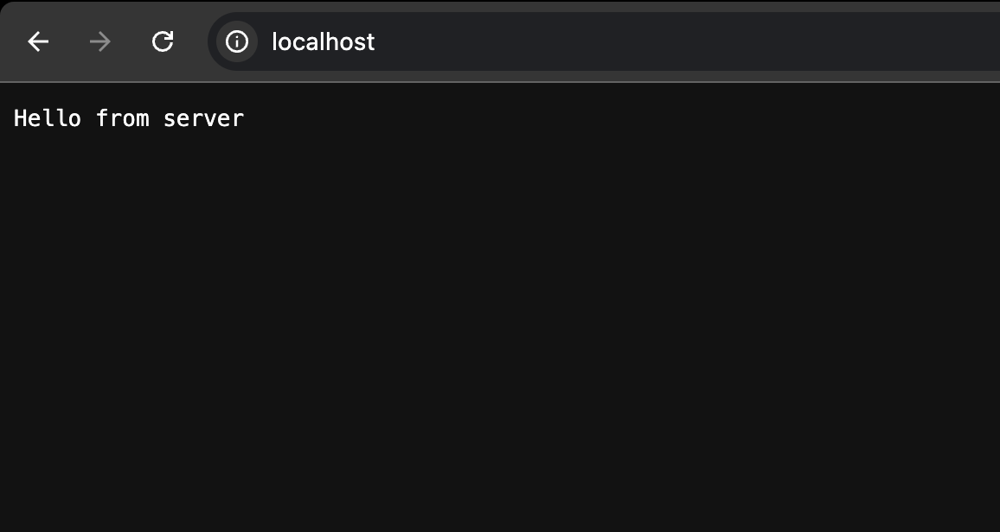
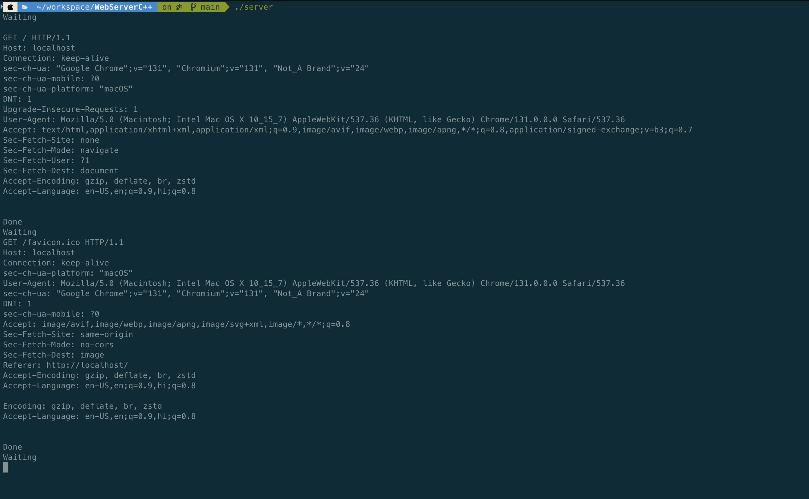

# Web Server in C++ 

This project provides a modular C++ networking solution with reusable components for building and testing socket servers.

## What's Inside? 

- 🧩 Modular Design: Organized into server and socket components for clarity and scalability.
- 🔌 Socket Abstraction: Easy-to-use classes for creating binding and listening sockets.
- 🚀 Test Server: A simple server implementation for quick development and testing.
- 🛠️ Custom Networking Tools: Extendable components to suit your networking needs.

### Directory Structure 

```bash 

├── README.md
├── _weblib.hpp
├── main_server.cpp
├── main_socket.cpp
├── networking
│   ├── _network_lib.hpp
│   ├── server
│   │   ├── _server_lib.hpp
│   │   ├── server.cpp
│   │   ├── server.hpp
│   │   ├── test_server.cpp
│   │   └── test_server.hpp
│   └── socket
│       ├── _socket_lib.hpp
│       ├── binding_socket.cpp
│       ├── binding_socket.hpp
│       ├── listening_socket.cpp
│       ├── listening_socket.hpp
│       ├── socket.cpp
│       └── socket.hpp
├── server # server executable (available after build)
└── socket # socket executable (available after build)

```

### Compilation 

To compile the test server 

```bash 

g++ -std=c++11 -I./networking   main_server.cpp networking/*/*.cpp  -o server

```

To compile the socket listener 

```bash 

g++ -std=c++11 -I./networking   main_socket.cpp networking/*/*.cpp  -o socket

```

### Working Explained 

Server Initialization: The Server base class initializes sockets and manages communication.

Test Server: The TestServer class extends the Server class and handles:

- acceptor(): Accepts incoming connections.
- handler(): Reads client messages.
- responder(): Sends responses back to the client.

Socket Abstraction:

- Provides reusable components for binding, listening, and handling sockets.

### Screens 

The browser making the request and getting the response 



The server logs 




#### Credits 

Thanks to [Eric's Videos](https://www.youtube.com/@eom-dev) which made this possible! 